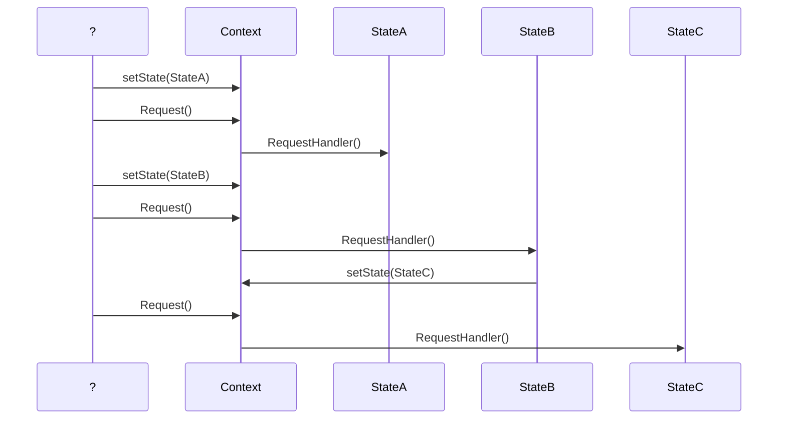

# **Patrón Comportamental**
## **State**

El patrón de diseño **State** se caracteriza por modificar su comportamiento *dependiendo del estado en el que se encuentra la aplicación*. Para lograr esto, es necesario crear una serie de clases que representarán los distintos estados por los que puede pasar la aplicación *(se requiere de una clase por cada estado por el que la aplicación pueda pasar)*.

## **Componentes**

 - **Context:**  Representa el componente que puede cambiar de estado, el cual tiene entre sus propiedades el estado actual *(mantiene una instancia con el estado actual)*.
 
 -  **AbstractState:** Clase base para la generación de los distintos estados. Se recomienda que sea una clase abstracta en lugar de una interface debido a que podemos definir comportamientos por default y así afectar el funcionamiento de todos los estados.
 
 - **ConcreteState:** Cada uno de estos componentes representa un posible estado por el cual la aplicación puede pasar, por lo que tendremos un ConcreteState por cada estado posible. Esta clase debe de heredar de AbstractState.
 
 ### Estructura de un patrón de diseño State

### Diagrama de secuencias del patrón State.

 1. Se establece un estado por default al  _Context_, el cual es  _StateA_.
 2. Se ejecuta la operación request sobre el  _Context_, la cual delega la ejecución al estado actual (StateA). 
 3. El  _Context_ cambia del  _estado A_ al  _estado B_.
 4.  Se ejecuta nuevamente la operación request sobre el  _Context_ que delega la ejecución al estado actual (StateB).
5.  La ejecución del  _StateB_ da como resultado un cambio de estado al  _StateC_.
6. Se ejecuta nuevamente la operación request sobre el  _Context_ que delega la ejecución al estado actual (StateC).

## **Utilidad**
### Este patrón resulta útil cuando
- Se necesita que un objeto se comporte de forma diferente dependiendo del estado interno en el que se encuentren en cada momento y debe cambiar en tiempo de ejecución.
- Las operaciones tiene largas sentencias con múltiples ramas que dependen del estado del objeto.

*El Context delega el estado específico al objeto StateConcreto actual.  Un objeto Context puede puede pasarse a sí mismo como parametro a un objeto State. De esta manera la clase State puede acceder al contexto si fuese necesario. Context es la interfaz principal para el cliente. Tanto el objeto Context como los objetos de StateConcreto pueden decidir el cambio de estado.*

## Consecuencias
-   Se localizan fácilmente responsabilidades de los estados concretos dado que se encuentran en las clases que corresponden a cada estado.
-   Hace los cambios de estado explícitos, pues al estar representado cada estado se facilita la ampliación mediante una simple herencia, sin afectar el context.
-   Permite cambiar el estado en tiempo de ejecución.
-   Los estados pueden ser reutilizados.
-   Se incrementa el número de subclases.

